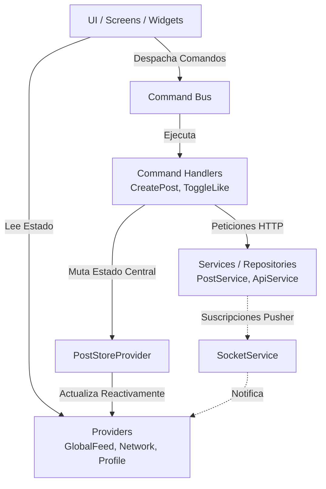

# Informe Técnico del Proyecto Flutter: PoliRed

## 1. Introducción Técnica

**PoliRed** es una aplicación móvil desarrollada en Flutter orientada a conectar estudiantes en redes o comunidades académicas y sociales. El proyecto está construido para Android con un diseño técnico moderno que combina el manejo de estado reactivo mediante Provider, una capa de servicios orientada a la inyección de dependencias, y la implementación de un patrón CQRS (Command Query Responsibility Segregation) para el manejo de mutaciones complejas (como la interacción con publicaciones). El objetivo general es proveer una plataforma altamente interactiva que soporte feeds de publicaciones, mensajería en tiempo real, notificaciones push, gestión de redes comunitarias y visualización de mapas integrados.

## 2. Tecnologías y Dependencias Principales

El ecosistema de la aplicación está basado en Flutter SDK ^3.10.1. A continuación, se detalla una tabla con las herramientas críticas utilizadas según el archivo pubspec.yaml:

| Categoría | Paquete / Tecnología | Versión | Propósito / Uso en PoliRed |
| :--- | :--- | :--- | :--- |
| **Arquitectura y Estado** | provider | ^6.1.5+1 | Manejo de estado reactivo mediante ChangeNotifiers y ProxyProviders. |
| **Enrutamiento** | go_router | ^17.2.3 | Navegación declarativa, interceptación de rutas y deep linking. |
| **Comunicaciones** | http | ^1.6.0 | Capa base para solicitudes REST hacia el backend. |
| **Tiempo Real** | pusher_channels_flutter | ^2.2.0 | Conexión WebSockets para el sistema de chat y notificaciones push. |
| **Mapas** | mapbox_maps_flutter | ^2.3.0 | Despliegue de mapas interactivos y Puntos de Interés (POIs). |
| **Almacenamiento** | flutter_secure_storage | ^10.3.1 | Persistencia segura local (ej. JWT Tokens, Datos de Usuario). |
| **Manejo de Medios** | image_picker, image_cropper | Varios | Selección, toma de fotografías y recorte para perfiles y posts. |
| **Optimización** | flutter_image_compress | ^2.4.0 | Reducción de bytes y escalado antes de envíos multiparte. |
| **Interfaz y UI** | google_fonts, flutter_svg | Varios | Tipografías enriquecidas e iconografía vectorial personalizada. |
| **Utilidades** | flutter_dotenv | ^6.0.1 | Manejo seguro de variables de entorno y API Keys (.env). |

## 3. Arquitectura Implementada

El proyecto utiliza una arquitectura de **Capas Separadas (Layered Architecture)** con fuerte influencia de **CQRS** para operaciones de dominio complejas y el patrón **Service-Repository** para la abstracción de datos.

### 3.1. Diagrama de Arquitectura de Capas

El siguiente diagrama ilustra cómo se interconectan los componentes del sistema, especialmente el uso centralizado del CommandBus y el PostStoreProvider:



### 3.2. Estructura del Proyecto (lib/)

A continuación se detalla la estructura completa de carpetas basada en los archivos reales en el proyecto:

```text
lib/
├── main.dart
├── config/
│   ├── constants.dart
│   ├── routes.dart
│   ├── spacing.dart
│   └── theme.dart
├── models/
│   ├── commands/
│   │   └── feed_command.dart
│   ├── events/
│   │   └── post_event.dart
│   ├── conversation_model.dart
│   ├── feed_context.dart
│   ├── message_model.dart
│   ├── network_profile_model.dart
│   ├── network_story_model.dart
│   ├── notification_model.dart
│   ├── poi_model.dart
│   ├── post_model.dart
│   ├── public_profile_model.dart
│   ├── public_user_model.dart
│   ├── suggested_network_model.dart
│   └── user_model.dart
├── providers/
│   ├── auth_provider.dart
│   ├── chat_provider.dart
│   ├── explore_networks_provider.dart
│   ├── explore_users_provider.dart
│   ├── feed_provider.dart
│   ├── global_feed_provider.dart
│   ├── map_provider.dart
│   ├── messages_inbox_provider.dart
│   ├── my_profile_feed_provider.dart
│   ├── network_profile_provider.dart
│   ├── network_provider.dart
│   ├── notification_provider.dart
│   ├── post_store_provider.dart
│   └── public_profile_provider.dart
├── repositories/
│   └── conversations_repository.dart
├── screens/
│   ├── main_layout_screen.dart
│   ├── auth/
│   │   ├── complete_profile_screen.dart
│   │   ├── forgot_password_screen.dart
│   │   ├── login_screen.dart
│   │   ├── register_screen.dart
│   │   ├── splash_screen.dart
│   │   └── welcome_screen.dart
│   ├── explore/
│   │   ├── explore_networks_screen.dart
│   │   ├── explore_screen.dart
│   │   ├── network_profile_screen.dart
│   │   ├── public_profile_screen.dart
│   │   └── widgets/
│   │       ├── explore_empty_state.dart
│   │       ├── explore_error_state.dart
│   │       ├── explore_header.dart
│   │       ├── explore_loading.dart
│   │       ├── explore_tabs.dart
│   │       └── restricted_feed_overlay.dart
│   ├── home/
│   │   └── home_screen.dart
│   ├── map/
│   │   ├── map_screen.dart
│   │   ├── utils/
│   │   │   ├── campus_polygon.dart
│   │   │   └── marker_image_util.dart
│   │   └── widgets/
│   │       ├── poi_detail_sheet.dart
│   │       ├── poi_directory_sheet.dart
│   │       └── poi_search_bar.dart
│   ├── messages/
│   │   ├── chat_screen.dart
│   │   └── messages_screen.dart
│   ├── notifications/
│   │   └── notifications_screen.dart
│   ├── post/
│   │   ├── add_post_screen.dart
│   │   └── post_detail_screen.dart
│   ├── profile/
│   │   ├── edit_profile_screen.dart
│   │   ├── liked_posts_screen.dart
│   │   ├── profile_screen.dart
│   │   ├── saved_posts_screen.dart
│   │   ├── settings_screen.dart
│   │   └── update_password_screen.dart
│   └── settings/
│       ├── about_screen.dart
│       ├── apelar_red_screen.dart
│       ├── help_detail_screen.dart
│       ├── help_screen.dart
│       ├── legal_document_screen.dart
│       ├── network_officialization_screen.dart
│       ├── network_verification_screen.dart
│       ├── privacy_screen.dart
│       ├── request_network_screen.dart
│       ├── strikes_screen.dart
│       └── support_screen.dart
├── services/
│   ├── handlers/
│   │   ├── command_handler.dart
│   │   └── post_command_handlers.dart
│   ├── api_service.dart
│   ├── auth_service.dart
│   ├── command_bus.dart
│   ├── explore_user_service.dart
│   ├── navigation_bus.dart
│   ├── navigation_service.dart
│   ├── network_service.dart
│   ├── notification_service.dart
│   ├── poi_data.dart
│   ├── post_service.dart
│   ├── public_profile_service.dart
│   ├── read_model_cache_service.dart
│   ├── socket_service.dart
│   └── storage_service.dart
├── utils/
│   ├── app_snackbar.dart
│   ├── feed_selectors.dart
│   ├── image_compression.dart
│   ├── json_ids.dart
│   ├── network_acronym.dart
│   ├── post_context_resolver.dart
│   └── validators.dart
└── widgets/
    ├── core/
    │   ├── base_screen.dart
    │   └── keyboard_aware_layout.dart
    ├── app_text_field.dart
    ├── chat_options_bottom_sheet.dart
    ├── comment_tree_sheet.dart
    ├── community_post_card.dart
    ├── disabled_network_overlay.dart
    ├── fullscreen_image_viewer.dart
    ├── global_post_card.dart
    ├── leave_network_dialog.dart
    ├── likes_bottom_sheet.dart
    ├── network_avatar.dart
    ├── network_badge.dart
    ├── network_list_dialog.dart
    ├── network_options_bottom_sheet.dart
    ├── polired_logo.dart
    ├── post_card.dart
    ├── post_image_carousel.dart
    ├── post_options_bottom_sheet.dart
    ├── primary_button.dart
    ├── public_profile_grid.dart
    ├── public_profile_header.dart
    ├── report_network_bottom_sheet.dart
    ├── report_post_bottom_sheet.dart
    ├── report_user_bottom_sheet.dart
    ├── safe_network_image.dart
    ├── suspended_overlay.dart
    └── user_search_tile.dart
```

### 3.3. Patrones Estructurales Relevantes

- **Inyección de Dependencias:** Lograda nativamente en Flutter agrupando servicios como singletons mediante Provider.value() en el nivel superior de la app (main.dart).
- **Proxy Providers:** Uso extensivo de ChangeNotifierProxyProvider para componer dependencias reactivas (ej: recargar el feed global cuando el estado de autenticación cambia o inyectar PostStoreProvider en los providers de perfiles).
- **CQRS:** Para evitar cuellos de botella en mutaciones distribuidas, el proyecto usa un CommandBus. Los comandos como CreatePostCommandHandler, ToggleLikeCommandHandler, y DeletePostCommandHandler alteran el estado centralizado de PostStoreProvider, garantizando consistencia a lo largo de diferentes pantallas.

## 4. Flujos Principales y Módulos Internos

### 4.1. Flujo de Arranque y Configuración Global (main.dart)

1. Carga de variables de entorno usando flutter_dotenv desde .env.
2. Inicialización de MapboxOptions.setAccessToken a nivel global.
3. Inicialización síncrona del StorageService.
4. Instanciación en memoria (fuera del widget tree) de la capa de servicios y repositorios (API, Sockets, Auth, Network).
5. Configuración del CommandBus y registro de sus *Handlers*.
6. Inyección del árbol de dependencias mediante MultiProvider.

### 4.2. Flujo de Navegación (routes.dart)

La navegación está centralizada usando go_router.

- **Redirects dinámicos:** En la función redirect de GoRouter se consume el AuthProvider síncronamente. Si el usuario no está autenticado, la navegación se redirige forzosamente a /login.
- **Completar Perfil:** Si el usuario está autenticado pero la bandera perfilCompleto es falsa, se redirige forzosamente a /complete-profile para impedir la navegación al resto de la app.
- **Rutas paramétricas:** Se utilizan rutas avanzadas como /explore/networks/:id o /chat/:id pasando identificadores. También se apoya en un NavigationBus para realizar redirecciones imperativas desde la capa de servicios/comandos.

### 4.3. Autenticación y Perfil (AuthProvider y AuthService)

- Gestiona el token JWT mediante StorageService.
- Consume endpoints REST definidos en AppConstants (/auth/login, /registro-estudiantes, /perfil-estudiante).
- Al autenticarse con éxito, notifica a los *Proxy Providers* descendientes y ejecuta la suscripción al canal privado de Websockets (Pusher).
- Monitorea el estado de la cuenta (ej. suspensiones por strikes), forzando un estado de restricción o cerrando la sesión al detectar respuestas HTTP 403 (Forbidden).

### 4.4. Comunicación con el Backend (ApiService)

- Es la capa base para todas las peticiones de red usando http.
- Centraliza la inyección del token Bearer en los *Headers*.
- Estandariza las respuestas bajo el envoltorio genérico ApiResult<T>, facilitando el manejo de excepciones, timeouts y parseo del payload en un solo lugar.
- Soporta peticiones multipartRequest críticas para la subida de imágenes (usado intensivamente en perfiles y posts).

### 4.5. Sistema de Tiempo Real y Sockets (SocketService)

- Integración directa con **Pusher** (pusher_channels_flutter).
- Estado administrado por ValueNotifier<SocketConnectionPhase> para visualizar la conexión y reconexión.
- Se suscribe a canales privados: private-user-$uid y delega eventos recibidos usando un patrón Pub/Sub personalizado a través de los métodos .on() y .off().
- Este servicio es consumido proactivamente por NotificationProvider y MessagesInboxProvider para actualizar UI sin pull-to-refresh.

### 4.6. Manejo de Publicaciones y Feeds (PostStoreProvider & CQRS)

- Diferentes fuentes de feed coexisten en la app (GlobalFeedProvider, NetworkProvider, MyProfileFeedProvider).
- Para evitar que la lógica de "Like", "Save" o "Delete" se duplique, el estado atómico de las publicaciones reside en el PostStoreProvider.
- La UI despacha *Comandos* (CommandBus) que interactúan con PostService, mutan el backend y finalmente el PostStoreProvider actualiza las entidades localmente, reflejando el cambio reactivamente en todas las pantallas simultáneamente.

### 4.7. Módulo de Chat (chat_provider.dart y Repositorio)

- Permite listar conversaciones mediante ConversationsRepository.
- La carga de mensajes es reactiva. Se apoya fuertemente en eventos del SocketService para anexar mensajes nuevos a la vista sin recargar.

### 4.8. Implementación de Mapas (MapProvider y MapScreen)

- Usa mapbox_maps_flutter. La API Key (MAPBOX_ACCESS_TOKEN) se lee desde el .env.
- Implementa POIs (Puntos de Interés) definidos en el modelo PoiModel para mostrar información espacial relevante (como redes o comunidades geolocalizadas) en la vista MapScreen.

### 4.9. Moderación y Suspensión de Cuentas y Redes (Strikes)

- **Sistema de Infracciones (Usuarios y Redes):** Tanto los usuarios (`UserModel`) como las redes pueden acumular advertencias o "strikes" por infringir normas comunitarias.
- **Bloqueos por Suspensión:** Cuando un usuario acumula 5 strikes, su estado `suspendido` se vuelve verdadero. El `AuthProvider` detecta esto y la interfaz renderiza un `SuspendedOverlay`. Similarmente, si una red alcanza 5 strikes, pasa a estado `deshabilitada` y al intentar visitarla se mostrará un `DisabledNetworkOverlay`.
- **Transparencia y Apelaciones:** 
  - Para usuarios, a través de la pantalla `StrikesScreen`, pueden consultar sus advertencias y el motivo de los reportes.
  - Para redes, los administradores cuentan con la pantalla `ApelarRedScreen` para enviar un recurso de apelación directamente desde la app en caso de deshabilitación, comunicándose con el endpoint dedicado.

### 4.10. Integración con Endpoints REST (Backend)

La aplicación consume una API REST desplegada en https://polired-api.vercel.app/api. A continuación se detallan los endpoints mapeados en AppConstants y operados por la capa de servicios:

> **Nota:** Los endpoints listados representan el contrato HTTP con el backend.
> En el código fuente, las rutas se construyen composicionalmente desde constantes
> centralizadas en `AppConstants` (ver `lib/config/constants.dart`).

| Módulo | Endpoint | Método HTTP | Descripción |
| :--- | :--- | :--- | :--- |
| **Auth & Perfil** | `/auth/login` | POST | Autenticación y obtención de token JWT. |
| | `/registro-estudiantes` | POST | Creación de cuenta de estudiante. |
| | `/recuperar-password-e` | POST | Flujo de recuperación de contraseña. |
| | `/perfil-estudiante` | GET | Obtener datos completos del usuario logueado. |
| | `/completar/perfil` | PATCH | Completar los datos requeridos tras el registro (Multipart). |
| | `/estudiante/:id` | PATCH | Actualizar datos del estudiante (Ej. Avatar, Portada). |
| | `/perfil/username` | PATCH | Actualizar el nombre de usuario de forma independiente. |
| | `/estudiante/actualizarpassword` | PATCH | Cambiar la contraseña del usuario logueado. |
| **Exploración y Usuarios** | `/cargar/estudiantes` | GET | Listado global paginado del directorio de estudiantes activos. |
| | `/perfil-publico/:id/info` | GET | Obtener datos para mostrar el perfil público de terceros. |
| | `/perfil-publico/:id/feed` | GET | Obtener el muro o publicaciones (paginado) de un estudiante. |
| | `/reportes/usuario` | POST | Enviar reporte de la conducta o perfil de un usuario. |
| **Redes / Comunidades** | `/redes/listar` | GET | Listar todas las redes disponibles y buscar. |
| | `/estudiantes/listar/redes` | GET | Obtener redes a las que el usuario actual pertenece. |
| | `/redes/:id` | GET | Obtener el feed/información específica de una red (paginado). |
| | `/estudiantes/unirse/red` | POST | Solicitar afiliación/unirse a una comunidad. |
| | `/redes/solicitar-creacion` | POST | Solicitar la creación de una nueva comunidad. |
| | `/redes/solicitar-verificacion` | POST | Solicitar verificación como administrador de una red. |
| | `/redes/solicitar-oficializacion` | POST | Solicitar oficialización como administrador de una red. |
| | `/reportes/red` | POST | Enviar un reporte contra una red/comunidad. |
| | `/salirse/red` | POST | Abandonar una red de la que se es miembro. |
| | `/apelaciones/red` | POST | Enviar apelación para restaurar una red deshabilitada. |
| **Publicaciones** | `/publicaciones/global` | GET | Feed paginado de todas las publicaciones públicas. |
| | `/publicaciones/comunitarias` | GET | Feed de publicaciones de las redes propias. |
| | `/publicaciones/articulos/global` | GET | Feed global enfocado en el Marketplace de Artículos. |
| | `/publicaciones/red/:id` | GET | Obtener publicaciones exclusivas de una red. |
| | `/estudiantes/publicaciones` | POST | Crear una publicación estándar (soporta Multipart para imágenes). |
| | `/publicaciones/articulos` | POST | Crear una publicación tipo artículo/marketplace. |
| | `/publicaciones/extendida` | POST | Crear una publicación con múltiples características extra. |
| | `/publicaciones/eliminar/:id` | DELETE | Eliminar una publicación creada por el usuario. |
| | `/publicaciones/articulo/eliminar/:id` | DELETE | Eliminar un artículo creado por el usuario. |
| **Interacción Social** | `/publicaciones/:id/like` | POST/DELETE | Acción para dar (POST) o quitar (DELETE) 'Me Gusta'. |
| | `/publicaciones/:id/guardar` | POST/DELETE | Guardar o quitar de guardados una publicación. |
| | `/publicaciones/:id/comentarios/arbol` | GET | Cargar todo el árbol completo de comentarios de un post. |
| | `/publicaciones/:id/likes` | GET | Obtener la lista de usuarios que dieron "Me gusta". |
| | `/publicaciones/:id/comentarios` | POST | Agregar un nuevo comentario principal en una publicación. |
| | `/comentarios/:id/responder` | POST | Responder a un comentario específico dentro del árbol. |
| | `/usuarios/guardados` | GET | Obtener el feed paginado de publicaciones guardadas por el usuario. |
| | `/usuarios/likes` | GET | Obtener el feed paginado de publicaciones a las que el usuario dio like. |
| | `/reportes/publicacion` | POST | Reportar contenido inadecuado o spam de una publicación. |
| | `/reportes/articulo` | POST | Reportar contenido inadecuado o spam de un artículo. |
| **Mensajes y Chats** | `/conversaciones` | GET | Listado del inbox de chats y conversaciones activas. |
| | `/entre/:contactId` | GET | Abrir o recuperar una conversación 1 a 1 con un contacto. |
| | `/conversacion/:id` | GET | Historial paginado de mensajes de una sala de chat. |
| | `/:id/leidos` | POST | Marcar los mensajes de una sala/conversación como leídos. |
| | `/send` | POST | Enviar un mensaje de chat dentro de una conversación. |
| | `/api/pusher/auth` | POST | Autenticación para WebSockets privados (Pusher channels). |
| **Notificaciones** | `/notificaciones` | GET | Obtener lista general paginada de notificaciones. |
| | `/notificaciones/:id/leida` | PATCH | Marcar como leída una notificación específica. |
| **App** | `/reportes/app` | POST | Enviar un reporte general de bugs o problemas técnicos de la aplicación. |

## 5. Almacenamiento, Persistencia y Cache

- **StorageService:** Wrapper estático sobre flutter_secure_storage. Utiliza claves constantes como AppConstants.tokenKey y AppConstants.userKey para persistir la sesión de forma segura.
- **ReadModelCacheService:** Servicio en memoria para evitar llamadas redundantes a la API al cambiar de pestañas, útil para optimizar la red de endpoints pesados.
- **Cache Multimedia:** Las imágenes remotas son procesadas y cacheadas agresivamente usando cached_network_image. Las subidas locales se minimizan usando flutter_image_compress antes de enviar el multipart a la API.

## 6. UI/UX y Diseño (Widgets)

- Usa un archivo theme.dart centralizado para tipografías (Google Fonts) y colores consistentes.
- Existen gran variedad de BottomSheets modulares: comment_tree_sheet.dart, likes_bottom_sheet.dart, network_options_bottom_sheet.dart, report_post_bottom_sheet.dart.
- Utiliza carruseles de imágenes interactivos (post_image_carousel.dart) y un visualizador en pantalla completa (fullscreen_image_viewer.dart).
- Avatares de red seguros (network_avatar.dart, safe_network_image.dart) previenen crashes por URLs inválidas.
- Overlays restrictivos para control de acceso como `suspended_overlay.dart` para usuarios y `disabled_network_overlay.dart` para redes sancionadas.

## 7. Optimización, Rendimiento y Seguridad

### 7.1. Optimización

- **ProxyProviders:** Inicialización tardía o "lazy" de recursos pesados. Los feeds de red y perfil global se vacían o recargan automáticamente según los cambios en el ciclo de vida del AuthProvider.
- **Inmutabilidad y CQRS:** La separación de comandos minimiza renders innecesarios en la jerarquía de widgets.
- **Compresión Local:** No se sube una imagen tal cual se toma; flutter_image_compress optimiza bytes en memoria.

### 7.2. Seguridad

- Las URLs de base de API y Websockets en constants.dart apuntan a infraestructura remota (polired-api.vercel.app), pero se soporta inyección por entorno local si es necesario.
- Los tokens MAPBOX_ACCESS_TOKEN y MAPBOX_DOWNLOADS_TOKEN están completamente externalizados en el .env, excluidos de control de versiones vía .gitignore.
- La intercepción de navegación mediante go_router funciona como guardia robusto (Route Guard) garantizando que usuarios sin sesión no puedan acceder a rutas protegidas bajo ninguna circunstancia.
- Peticiones HTTPS mandatorias para el backend alojado en Vercel.

## 8. Auditoría de Calidad y Pruebas (QA)

Como parte del rigor técnico del proyecto, PoliRed cuenta con un robusto banco de pruebas automatizadas y procesos de validación manual que certifican el correcto funcionamiento de la arquitectura, la lógica de negocio y la reactividad de la interfaz.

El proceso de QA abarcó las siguientes dimensiones:
- **Pruebas Unitarias (Unit Testing):** Validación aislada de las capas de Servicio, Handlers de CQRS y Proveedores de Estado, comprobando respuestas a peticiones exitosas, fallidas y escenarios de *rollback*.
- **Pruebas de Widgets (Widget Testing):** Renderizado simulado de la interfaz para comprobar las interacciones del usuario, el formateo de errores locales y el redibujado condicional frente a mutaciones de estado en el entorno Reactivo (CQRS).
- **Pruebas de Compatibilidad:** Evaluación manual en múltiples dispositivos (físicos y emuladores) con distintas resoluciones y versiones de Android para confirmar una experiencia de usuario (UX/UI) cohesiva y sin errores de adaptabilidad.

Para examinar el desglose técnico detallado, los fragmentos de código de los escenarios evaluados, los *refactorings* estructurales (como el Patrón Fake y la inyección de dependencias HTTP) aplicados durante el ciclo de pruebas y el estado de aprobación final (24 tests en verde sobre 11 componentes críticos), **consulte el documento oficial de evidencias:**

[👉 **Ver Evidencia de Pruebas Completa**](./evidencia_pruebas.md)

## 9. Riesgos Técnicos y Mejoras Recomendadas

1. **Pusher Channels Fijos:** En el archivo socket_service.dart, la apiKey y el cluster de Pusher están quemados (*hardcoded*) directamente en la inicialización en vez de estar inyectados desde .env. Es un riesgo potencial si se requiere rotar credenciales.
2. **Dependencia Fuerte a Singletons Dinámicos:** El modelo CQRS mezclado con Proveedores inyectados hace que el tracing del flujo de un comando pueda ser oscuro para nuevos desarrolladores.
3. **Escalabilidad del Cache:** ReadModelCacheService actualmente reside en memoria temporal. Para una experiencia offline pura o persistencia a largo plazo, migrar a Hive, Isar o SQLite (vía sqflite) brindaría un rendimiento inmensamente superior.
4. **Manejo de Excepciones del Socket:** La conexión con Pusher realiza intentos de reconexión, sin embargo, el encolamiento de mensajes enviados offline no está cubierto, por lo que podrían perderse si la red falla temporalmente.

## 10. Conclusiones Técnicas

PoliRed presenta una arquitectura de código sorprendentemente madura para una aplicación basada en Flutter. La correcta decisión de separar la lectura del modelo de la escritura (a través del acercamiento CQRS) previene los típicos problemas de inconsistencia visual en feeds paginados de redes sociales. Las integraciones clave (API, Websockets, Mapas, Storage) están debidamente segregadas en servicios, y el enrutamiento está centralizado con go_router. El sistema cumple con un estándar empresarial y su base de código facilita un futuro escalamiento a nuevas funcionalidades.

## 11. Deuda Técnica Documentada

### Nomenclatura de constantes heredadas en `AppConstants`

**Archivo:** `lib/config/constants.dart`  
**Severidad:** Baja — no afecta funcionalidad  
**Detectado durante:** Refactorización de centralización de endpoints (junio 2026)

Las constantes `likeEndpoint` y `comentariosEndpoint` tienen nombres semánticamente
incorrectos: ambas apuntan al valor `'/publicaciones'` y actúan como prefijo base
para construir rutas dinámicas en los servicios (por ejemplo,
`'${AppConstants.comentariosEndpoint}/$id/comentarios'`).

El nombre apropiado para ambas sería `publicacionesBaseEndpoint`. Se mantuvieron
sus nombres originales para no interrumpir los servicios que ya dependían de ellas
al momento de detectarse el problema.

**Acción pendiente:** Renombrar ambas constantes a `publicacionesBaseEndpoint` y
actualizar todas las referencias en la capa de servicios en una tarea de refactorización
futura, una vez concluida la evaluación del jurado.